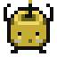

# Junimo Perfection Journal

A Stardew Valley perfection tracker for fish, cooking, crafting, shipping, friendships, and late-game goals.

```text
                _             _
               | |_   _ _ __ (_)_ __ ___   ___
            _  | | | | | '_ \| | '_ ` _ \ / _ \
           | |_| | |_| | | | | | | | | | | (_) |
            \___/ \__,_|_| |_|_|_| |_| |_|\___/
       ____            __           _   _
      |  _ \ ___ _ __ / _| ___  ___| |_(_) ___  _ __
      | |_) / _ \ '__| |_ / _ \/ __| __| |/ _ \| '_ \
      |  __/  __/ |  |  _|  __/ (__| |_| | (_) | | | |
      |_|  _\___|_|  |_|  \___|\___|\__|_|\___/|_| |_|
                _                              _
               | | ___  _   _ _ __ _ __   __ _| |
            _  | |/ _ \| | | | '__| '_ \ / _` | |
           | |_| | (_) | |_| | |  | | | | (_| | |
            \___/ \___/ \__,_|_|  |_| |_|\__,_|_|
```

<p align="center">
  
  
  
  
  
  
  
</p>

## How to Use

### Live Site

- Open [dantasqu.github.io/junimo-perfection-journal](https://dantasqu.github.io/junimo-perfection-journal/?v=20260424d)
- Progress is saved only in that browser on that device
- To move progress between computers, export on one device and import on the other

### Downloads

- `Mac zip`: unzip it and open `Junimo Perfection Journal.app`
- `Web zip`: unzip it and open `index.html` in a browser

## Inside the Tracker

- fish
- cooking
- crafting
- shipping
- friendships
- monster slayer goals
- skills, stardrops, golden walnuts, obelisks, and the Gold Clock
- import/export and local progress tracking

## Notes

- Based on Stardew Valley Wiki data.
- The live site does not have login or cloud sync.
- Some images inside the tracker load from Stardew Valley Wiki URLs, so an internet connection helps those appear.
- Current release: `1.2.0`

## Repo Layout

- `index.html`: app shell
- `styles.css`: Stardew-inspired UI styling
- `app.js`: tracker logic, rendering, save/import/export behavior
- `data/`: bundled wiki-derived tracker data
- `branding/current/`: current approved artwork
- `branding/site/`: artwork used on the live site
- `branding/social/`: GitHub/social preview exports
- `branding/concepts/`: alternate drafts and experiments
- `branding/references/`: Stardew and layout references
- `CHANGELOG.md`: release history
