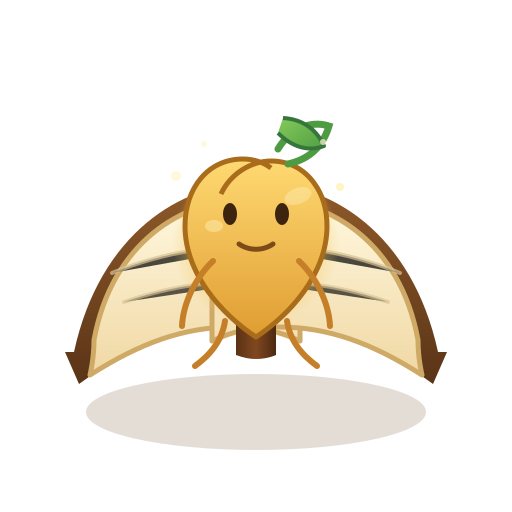

# Junimo Perfection Journal

A cozy Stardew Valley perfection tracker, currently available as a browser app and Mac app.

## Live Site

https://dantasqu.github.io/junimo-perfection-journal/

## Current Version

`1.1.0` — `Honey Junimo`

## Artwork Preview

This is the current open-book golden Junimo art that now appears in the latest app and web hero.



```text
          .-""""-.
       .-'  _  _  '-.
     .'   .' \/ '.   '.
    /   .'  /\   '.    \
   ;   /   /  \    \    ;
   |  ;   / /\ \    ;   |
   |  |  / /  \ \   |   |
   |  | |  .--.  |  |   |
   |  | | (o  o) |  |   |
   |  | |  \__/  |  |   |
   |  |  \  --  /   |   |
   ;   \  '.__.'   /    ;
    \   '.      .'    .'
     '.   '-..-'   .-'
       '-.______.-'
      __/  /||\  \__
   .-' _.-' || '-._ '-.
  /_.-'     ||     '-._\
```

## Use It

Open the live site in any modern browser, or open `index.html` locally.

## What's Included

- `index.html`: the app shell
- `styles.css`: the Stardew-inspired UI styling
- `app.js`: tracker logic and local save behavior
- `data/wiki-data.js`: bundled Stardew Wiki tracker data
- `branding/`: icon direction, palette, and visual references for the book + Junimo identity
- `CHANGELOG.md`: release history

## Notes

- Progress is saved in the browser on each device.
- The current hosted version is static because GitHub Pages is serving the front-end files directly.
- If we ever want accounts, shared saves, or cloud sync, we can move to a non-static setup with a backend later.
- Some images load from Stardew Valley Wiki URLs, so an internet connection helps those appear.
