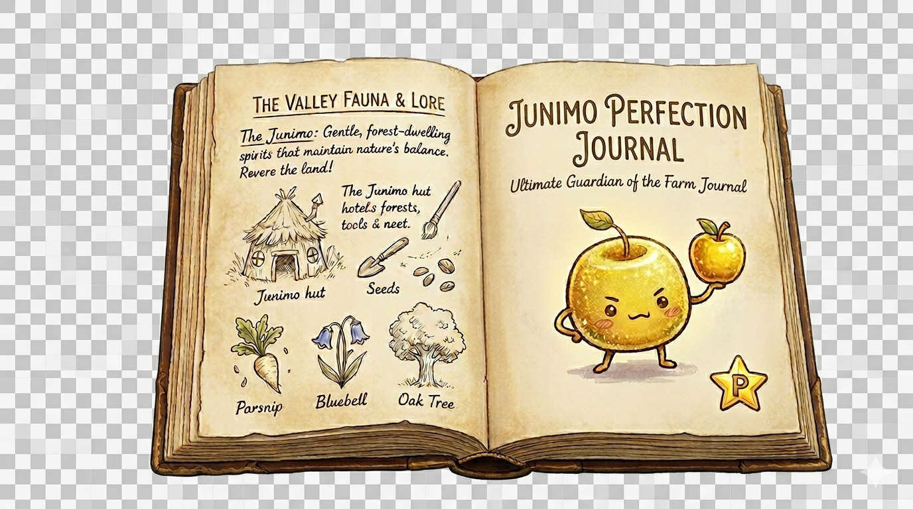

# Junimo Perfection Journal

A cozy Stardew Valley perfection tracker for everything standing between a farm and true perfection. This repo holds the web version.

```text
                _             _
               | |_   _ _ __ (_)_ __ ___   ___
            _  | | | | | '_ \| | '_ ` _ \ / _ \
           | |_| | |_| | | | | | | | | | | (_) |
            \___/ \__,_|_| |_|_|_| |_| |_|\___/

      |  _ \ ___ _ __ / _| ___  ___| |_(_) ___  _ __
      | |_) / _ \ '__| |_ / _ \/ __| __| |/ _ \| '_ \
      |  __/  __/ |  |  _|  __/ (__| |_| | (_) | | | |
      |_|  _\___|_|  |_|  \___|\___|\__|_|\___/|_| |_|

               | | ___  _   _ _ __ _ __   __ _| |
            _  | |/ _ \| | | | '__| '_ \ / _` | |
           | |_| | (_) | |_| | |  | | | | (_| | |
            \___/ \___/ \__,_|_|  |_| |_|\__,_|_|
```



## How to Use

### Live Site

- Open [dantasqu.github.io/junimo-perfection-journal](https://dantasqu.github.io/junimo-perfection-journal/?v=20260412)
- Best for quickly using the tracker on any computer with a browser
- Limitations: progress is saved only in that browser on that device, so it does not sync automatically between computers
- If someone wants to move progress between computers, they need to export their save file on one device and import it on the other

### Local Version

- Download the repo as a ZIP from GitHub with `Code` -> `Download ZIP`
- Unzip it
- Open `index.html` in a browser
- Your progress stays on that browser on that computer unless you export your save

## Inside the Tracker

- fish
- cooking
- crafting
- shipping
- friendships
- monster slayer goals
- skills, stardrops, golden walnuts, obelisks, and the Gold Clock
- import/export and local progress tracking

## Notes

- This repo is currently a static front-end hosted with GitHub Pages, which means it is just the site files themselves with no login, server, or cloud sync behind them.
- Some images inside the tracker load from Stardew Valley Wiki URLs, so an internet connection helps those appear.
- Current release: `1.1.0` — `Honey Junimo`

## Repo Layout

- `index.html`: app shell
- `styles.css`: Stardew-inspired UI styling
- `app.js`: tracker logic, rendering, save/import/export behavior
- `data/`: bundled wiki-derived tracker data
- `branding/current/`: current approved artwork
- `branding/site/`: artwork used on the live site
- `branding/social/`: GitHub/social preview exports
- `branding/concepts/`: alternate drafts and experiments
- `branding/references/`: Stardew and layout references
- `CHANGELOG.md`: release history
